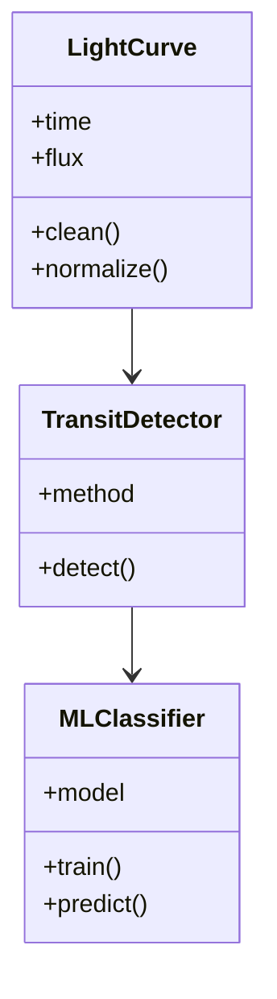

# Exoplanet Detector System  
### Sistema de Detecção de Exoplanetas usando Curvas de Luz e Ciência de Dados

Este projeto tem como objetivo desenvolver um sistema capaz de detectar possíveis exoplanetas utilizando o **método de trânsito**, analisando variações na luminosidade de estrelas ao longo do tempo.  
O sistema integra técnicas de **Ciência de Dados**, **algoritmos astronômicos (BLS)** e **Machine Learning**, oferecendo um pipeline completo para estudo e demonstração.

---

## Objetivos do Projeto
- Processar curvas de luz astronômicas.
- Detectar quedas periódicas associadas a trânsitos planetários.
- Aplicar o algoritmo **Box Least Squares (BLS)**.
- Treinar e utilizar um classificador com Machine Learning.
- Visualizar resultados de forma clara e acessível.
- Criar um pipeline reprodutível e modular.

---

## Funcionalidades
- Upload ou download de curvas de luz.
- Pré-processamento: remoção de ruídos, normalização e limpeza.
- Implementação do BLS para detecção de períodos.
- Classificação de possíveis trânsitos usando ML.
- Geração de gráficos automáticos.
- Organização completa para projetos de Data Science.

---

## Tecnologias Utilizadas

| Categoria | Tecnologias |
|----------|-------------|
| Linguagem | Python |
| Data Science | NumPy, Pandas, Matplotlib, Scikit-Learn |
| Astronomia | Astropy |
| Ambiente | Jupyter Notebook |
| Controle de versão | Git + GitHub |

---

## Estrutura do Projeto

```
exoplanet-detector-system/
│
├── data/
│   ├── raw/          # Dados originais
│   ├── processed/    # Dados pré-processados
│
├── src/
│   ├── preprocessing.py
│   ├── bls_detector.py
│   ├── ml_classifier.py
│   ├── visualization.py
│
├── notebooks/
│   ├── exploracao.ipynb
│   ├── bls_test.ipynb
│
├── docs/
│   ├── proposta.pdf
│
└── README.md
```

---

## Modelagem do Sistema

### Modelo de Classes (em Mermaid)



---

## Backlog (Histórias de Usuário)
#REFAZER
| ID | História | Critérios de Aceitação | Prioridade |
|----|----------|-------------------------|------------|
| US01 | Upload/download de curvas de luz | Preview carregado | Alta |
| US02 | Pré-processar curvas de luz | Dados limpos e normalizados | Alta |
| US03 | Detectar trânsitos com BLS | Períodos candidatos listados | Alta |
| US04 | Classificar com ML | Score gerado | Média |
| US05 | Visualizar gráficos | Gráficos gerados automaticamente | Média |
| US06 | Interface simples (opcional) | Interface mínima | Baixa |

---

## Planejamento de Sprints

### **Sprint 1 — Planejamento**
- Criação do repositório  
- Proposta do projeto  
- Backlog inicial  
- Modelagem preliminar  

### **Sprint 2 — Estrutura e Pré-processamento**
- Busca por datasets de curva de luz
- Estudo sobre BLS (entender que dados são relevantes do dataset)
- Pré-processamento inicial
- Manter documentação teórica necessária atualizada  

### **Sprint 3 — Implementação do BLS**  
- Implementação do BLS
- Detecção de trânsitos (Detecção de períodos candidatos)
- Visualizações preliminares  
- Testes iniciais
- Manter documentação teórica necessária atualizada  

### **Sprint 4 — Machine Learning**
#REFAZER
- Treinamento do classificador  
- Pipeline integrado  
- Ajustes gerais  

### **Sprint 5 — Finalização**
#REFAZER
- Testes  
- Documentação final  
- Versão final no GitHub  
- Preparação para apresentação  

---

## Exemplos de Visualizações (a implementar)
- Curva de luz original  
- Curva suave após pré-processamento  
- Trânsitos identificados pelo BLS  
- Resultado da classificação  

---

## 🛠 Como Executar o Projeto

### 1. Clonar o repositório
```bash
git clone git@github.com:SEU_USUARIO/exoplanet-detector-system.git
```

### 2. Instalar dependências
```bash
pip install -r requirements.txt
```

### 3. Executar notebooks
```bash
jupyter notebook
```

---

## Autor
**Carlos Petito**  
Estudante de Engenharia Elétrica – UERJ  
Ênfase em Sistemas e Computação  
Interesse em Ciência de Dados e Machine Learning

---

## Contribuições
Pull requests são bem-vindos.  

---

## Licença
Projeto desenvolvido para a disciplina **Engenharia de Sistemas A**.  
Uso acadêmico e educativo.
