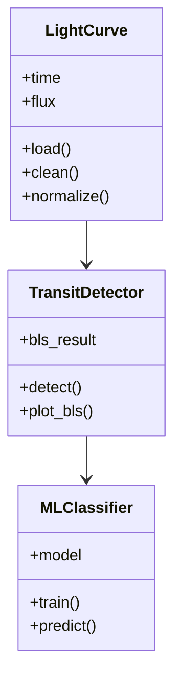

# 🏗 Modelagem Inicial do Sistema
Modelos e estrutura conceitual do projeto *Exoplanet Detector System*.

---

## 📌 Diagrama de Classes (Mermaid)



---

## 🔄 Fluxo Geral do Sistema

1. **Carregamento da curva de luz**
2. **Pré-processamento (limpeza, normalização)**
3. **Aplicação do algoritmo BLS**
4. **Identificação de trânsitos candidatos**
5. **Classificação via Machine Learning**
6. **Visualização dos resultados**

---

## 📁 Estrutura sugerida de pastas

```
exoplanet-detector-system/
│
├── data/
│   ├── raw/
│   ├── processed/
│
├── src/
│   ├── preprocessing.py
│   ├── bls_detector.py
│   ├── ml_classifier.py
│   ├── visualization.py
│
└── notebooks/
    ├── exploracao.ipynb
    ├── bls_test.ipynb
```
